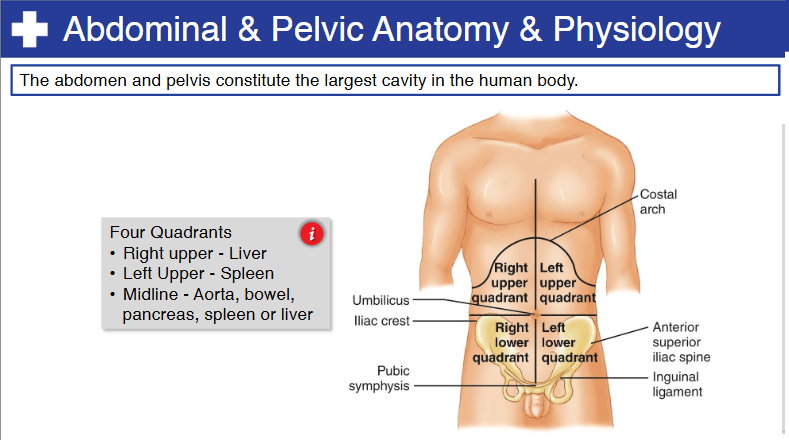
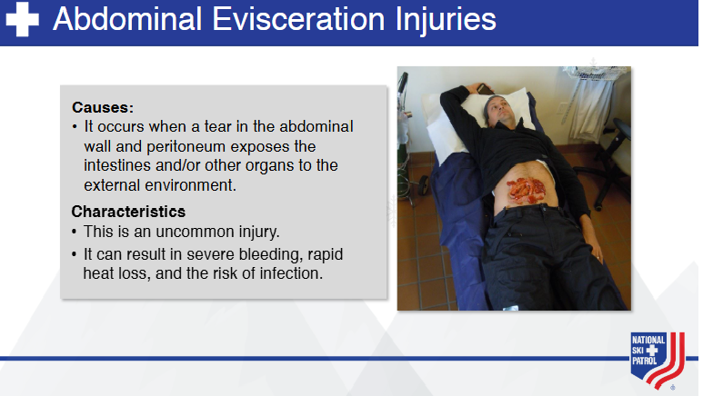
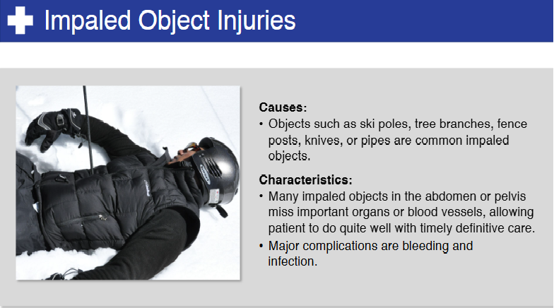
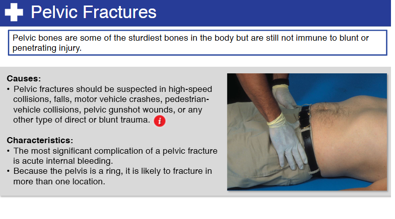
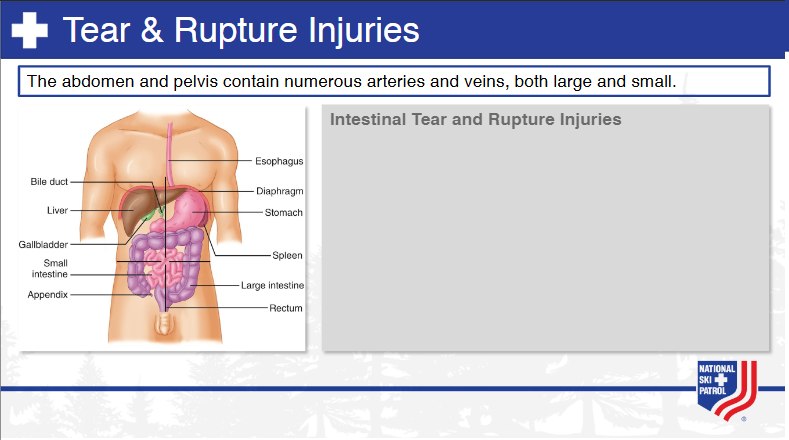

    
# Nsp Oec Training Chapter 24 

## National Ski Patrol - Outdoor Emergency Care chapter 24

    

    
## Table of Contents

- [Solution Overview](#solution-overview)
- [Who will use this ?](#who-can-use)
- [Advantages of Using](#advantages-of-using)
- [Return on Investment (ROI)](#return-on-investment-roi)
- [How it Works](#how-it-works)
- [Conclusion](#conclusion)
- [Getting Started](#getting-started)
- [Solution Features](#solution-features)
- [Code Features](#code-features)
- [Deliverables or Figures](#deliverables-or-figures)
- [Contact Information](#contact-information)

Chapter 24: Abdominal & Pelvic Trauma 

1. Identify and locate the major anatomic structures within the abdominal and pelvic cavities.
2. List and describe at least six abdominal and pelvic injuries.
3. Describe and demonstrate how to assess a patient with abdominal or pelvic trauma.
4. Describe and demonstrate how to manage a patient with abdominal or pelvic trauma.
5. Describe and demonstrate how to manage an abdominal evisceration.
6. Describe and demonstrate how to manage an impaled object in the abdomen or pelvis.
7. Describe and demonstrate how to manage a pelvic fracture.

## 24.1  Identify and locate the major anatomic structures within the abdominal and pelvic cavities.

The **abdominal** and **pelvic cavities** contain several major anatomic structures, including organs, blood vessels, muscles, and connective tissues. Here's a detailed overview of the structures in each cavity:

### **Abdominal Cavity**
The abdominal cavity is the upper part of the abdominopelvic cavity, located between the diaphragm and the pelvic cavity. It contains the following major structures:

#### 1. **Gastrointestinal (GI) Tract**
   - **Stomach**: Located in the upper left quadrant, the stomach breaks down food using acid and enzymes.
   - **Small Intestine**:
     - **Duodenum**: The first part, where most chemical digestion occurs.
     - **Jejunum and Ileum**: The middle and lower parts, responsible for nutrient absorption.
   - **Large Intestine (Colon)**:
     - **Ascending colon**: Located on the right side.
     - **Transverse colon**: Spans horizontally across the abdomen.
     - **Descending colon**: Located on the left side.
     - **Sigmoid colon**: Leads to the rectum.
   - **Rectum**: Stores waste before it is expelled from the body.

#### 2. **Liver**
   - Located in the upper right quadrant, the liver is responsible for detoxification, protein synthesis, and producing bile, which aids in fat digestion.

#### 3. **Gallbladder**
   - Located beneath the liver, it stores and concentrates bile produced by the liver.

#### 4. **Pancreas**
   - Located behind the stomach, the pancreas produces digestive enzymes and insulin, which regulates blood sugar levels.

#### 5. **Spleen**
   - Located in the upper left quadrant, the spleen filters blood, recycles red blood cells, and supports immune function.

#### 6. **Kidneys**
   - Located on either side of the spine in the retroperitoneal space (behind the peritoneum), the kidneys filter blood to produce urine.

#### 7. **Adrenal Glands**
   - Located on top of each kidney, these glands produce hormones such as adrenaline and cortisol.

#### 8. **Peritoneum**
   - A double-layered membrane that lines the abdominal cavity and covers the abdominal organs, providing protection and support.

### **Pelvic Cavity**
The pelvic cavity is located below the abdominal cavity, within the bony pelvis. It contains several vital organs, including parts of the urinary, reproductive, and digestive systems.

#### 1. **Urinary System**
   - **Bladder**: Located in the lower pelvic cavity, it stores urine until it is expelled from the body.
   - **Ureters**: Tubes that carry urine from the kidneys to the bladder.
   - **Urethra**: The tube that carries urine from the bladder to the outside of the body.

#### 2. **Reproductive System (Males)**
   - **Prostate Gland**: Located just below the bladder, it produces fluid that nourishes and protects sperm.
   - **Seminal Vesicles**: Located behind the bladder, they produce a component of semen.
   - **Vas Deferens**: Tubes that transport sperm from the testes to the urethra.

#### 3. **Reproductive System (Females)**
   - **Ovaries**: Located on either side of the uterus, they produce eggs and hormones.
   - **Fallopian Tubes**: Tubes that carry eggs from the ovaries to the uterus.
   - **Uterus**: Located in the center of the pelvic cavity, the uterus is where a fertilized egg implants and develops during pregnancy.
   - **Vagina**: A muscular canal that connects the uterus to the outside of the body.

#### 4. **Lower GI Tract**
   - **Rectum**: The final portion of the large intestine, located in the pelvic cavity, which stores feces until defecation.
   - **Anus**: The external opening at the end of the digestive tract.

#### 5. **Major Blood Vessels**
   - **Aorta**: The largest artery in the body, which passes through the abdominal cavity and bifurcates into the iliac arteries, supplying blood to the pelvis and lower limbs.
   - **Inferior Vena Cava**: The large vein that returns deoxygenated blood from the lower body to the heart.

#### 6. **Muscles**
   - **Pelvic Floor Muscles**: A group of muscles that support the pelvic organs and control the release of urine and feces.
   - **Psoas Muscle**: A large muscle that runs from the lumbar spine to the femur, playing a role in hip flexion and posture.

---

### **Summary of Locations**:
- **Abdominal cavity**: Contains the digestive organs (stomach, intestines, liver, pancreas), kidneys, and adrenal glands.
- **Pelvic cavity**: Contains the reproductive organs (ovaries, uterus, prostate), urinary organs (bladder, urethra), lower portion of the large intestine (rectum), and major blood vessels.

These structures work together to perform essential functions related to digestion, elimination, reproduction, and hormonal balance.

## 24.2  List and describe at least six abdominal and pelvic injuries.

Here are six common abdominal and pelvic injuries, including their descriptions, causes, and potential complications:

### 1. **Liver Laceration**
   - **Description**: A tear or cut in the liver tissue, often caused by blunt trauma (e.g., car accidents, falls) or penetrating trauma (e.g., stab wounds).
   - **Causes**: Blunt force to the abdomen or direct penetration.
   - **Symptoms**: Right upper abdominal pain, tenderness, bruising, signs of internal bleeding (e.g., shock, low blood pressure, rapid pulse), and abdominal distension.
   - **Complications**: Severe internal bleeding, hypovolemic shock, and liver dysfunction. In severe cases, surgery may be required to control bleeding.

### 2. **Spleen Rupture**
   - **Description**: A rupture of the spleen caused by trauma, leading to internal bleeding. The spleen is a highly vascular organ, so damage can cause significant hemorrhage.
   - **Causes**: Blunt trauma to the left upper abdomen (e.g., car accidents, sports injuries) or underlying conditions that weaken the spleen (e.g., mononucleosis).
   - **Symptoms**: Left upper abdominal pain, referred pain to the left shoulder (Kehr’s sign), tenderness, signs of shock, dizziness, and lightheadedness.
   - **Complications**: Life-threatening internal bleeding and the need for a splenectomy (removal of the spleen).

### 3. **Kidney Contusion or Laceration**
   - **Description**: Bruising (contusion) or tearing (laceration) of the kidney tissue due to trauma.
   - **Causes**: Blunt trauma to the lower back or flanks, falls, sports injuries, or motor vehicle collisions.
   - **Symptoms**: Flank pain (pain in the lower back or sides), hematuria (blood in the urine), abdominal pain, and signs of internal bleeding or shock in severe cases.
   - **Complications**: Internal bleeding, kidney damage, or kidney failure if not treated appropriately. Surgery may be required in severe cases.

### 4. **Pelvic Fracture**
   - **Description**: A break in one or more bones of the pelvis, ranging from simple fractures to complex, life-threatening injuries.
   - **Causes**: High-impact trauma (e.g., car accidents, falls from height, or crush injuries).
   - **Symptoms**: Severe pain in the pelvic area, inability to walk or bear weight, tenderness, swelling, bruising, and signs of shock due to internal bleeding.
   - **Complications**: Internal bleeding, injury to nearby organs (e.g., bladder, intestines, blood vessels), nerve damage, and shock. Severe pelvic fractures may require surgery and stabilization with external fixators.

### 5. **Bladder Rupture**
   - **Description**: A tear in the bladder wall, often caused by trauma or external pressure on a full bladder.
   - **Causes**: Blunt abdominal trauma (e.g., car accidents, falls) or penetrating injuries. More likely if the bladder is full at the time of injury.
   - **Symptoms**: Lower abdominal pain, difficulty urinating, blood in the urine (hematuria), and signs of internal bleeding. Inability to urinate may occur in some cases.
   - **Complications**: Leakage of urine into the abdominal cavity, risk of infection (peritonitis), and potential need for surgery to repair the bladder.

### 6. **Bowel Perforation**
   - **Description**: A hole or tear in the wall of the small or large intestine, allowing contents to spill into the abdominal cavity, leading to infection (peritonitis).
   - **Causes**: Blunt or penetrating trauma, severe infections (e.g., appendicitis), or inflammatory conditions (e.g., Crohn’s disease).
   - **Symptoms**: Severe abdominal pain, tenderness, guarding, nausea, vomiting, fever, and signs of peritonitis (rigid abdomen).
   - **Complications**: Peritonitis (inflammation of the abdominal lining), sepsis, and potential life-threatening infection if not treated promptly. Emergency surgery is typically required to repair the bowel.

---

### Summary of Injuries:
1. **Liver Laceration**: Caused by trauma, leading to internal bleeding.
2. **Spleen Rupture**: Often from blunt trauma, causing significant hemorrhage.
3. **Kidney Contusion/Laceration**: Trauma to the kidneys, potentially leading to hematuria and internal bleeding.
4. **Pelvic Fracture**: High-impact trauma, leading to pain, instability, and risk of internal organ damage.
5. **Bladder Rupture**: Tear in the bladder wall due to trauma, leading to urine leakage and infection.
6. **Bowel Perforation**: A tear in the intestine, causing severe infection and inflammation.

These injuries range from mild to life-threatening and often require rapid assessment, stabilization, and in many cases, surgical intervention.

## 24.3  Describe and demonstrate how to assess a patient with abdominal or pelvic trauma.

Assessing a patient with **abdominal or pelvic trauma** is crucial for identifying life-threatening injuries and determining the next steps for management. The evaluation includes a **primary survey**, **secondary survey**, and detailed examination of the abdomen and pelvis to identify signs of injury, bleeding, or shock. Below is a step-by-step guide on how to assess a patient with abdominal or pelvic trauma.

### **1. Primary Survey (ABCDE Approach)**
The primary survey is a quick assessment to identify life-threatening conditions.

#### **A: Airway**
- **Assess airway patency**: Ensure the patient’s airway is clear and unobstructed.
- **Cervical spine precautions**: If there is suspicion of a spinal injury (e.g., from a car accident or fall), immobilize the cervical spine.

#### **B: Breathing**
- **Assess breathing**: Check respiratory rate, effort, and symmetry of chest movements.
- **Oxygen administration**: If the patient is in respiratory distress, administer high-flow oxygen.

#### **C: Circulation**
- **Check circulation and perfusion**: Assess heart rate, blood pressure, capillary refill, and skin color.
- **Look for signs of shock**: These may include pale, cool, and clammy skin, low blood pressure, rapid heart rate (tachycardia), and decreased level of consciousness.
- **Control external bleeding**: Apply pressure to any visible wounds or bleeding sites.

#### **D: Disability**
- **Neurological assessment**: Check the patient’s level of consciousness (use the AVPU scale: Alert, Verbal, Pain, Unresponsive), and assess pupil response.

#### **E: Exposure and Environment**
- **Expose the abdomen and pelvis** to inspect for obvious signs of trauma (e.g., bruising, distension, lacerations).
- **Maintain body temperature**: Prevent hypothermia by covering the patient after the examination.

---

### **2. Secondary Survey (Focused Assessment)**
Once life-threatening injuries are addressed, conduct a more detailed **secondary survey**, focusing on the abdomen and pelvis.

#### **1. History (AMPLE)**
Gather a quick patient history using the **AMPLE** acronym:
- **A**: Allergies
- **M**: Medications
- **P**: Past medical history
- **L**: Last meal
- **E**: Events leading to the trauma (e.g., car accident, fall)

#### **2. Inspection**
- **Look for external signs of trauma**:
  - Bruising (e.g., **Cullen’s sign** around the umbilicus or **Grey-Turner’s sign** on the flanks, indicating internal bleeding).
  - **Distension**: Abdominal swelling or distension, which could suggest internal bleeding or bowel injury.
  - Penetrating injuries, lacerations, or open wounds.

#### **3. Auscultation**
- **Listen for bowel sounds**: Absence of bowel sounds may indicate peritonitis or bowel injury, while hyperactive sounds may suggest a bowel obstruction.
  
#### **4. Palpation**
- **Palpate the abdomen** systematically:
  - Gently press all four quadrants, assessing for tenderness, guarding (involuntary muscle contraction), or rebound tenderness (pain when pressure is released). This could indicate peritonitis or internal injury.
  - **Rigidity**: A rigid abdomen may suggest peritonitis or internal bleeding.
  - **Masses or fluid**: Palpable masses may indicate organ damage or bleeding. Fluid wave tests can help identify ascites (free fluid) in cases of injury.
  
#### **5. Percussion**
- **Percuss the abdomen** to assess for:
  - **Tympany**: A hollow sound may suggest bowel injury or gas in the abdomen (pneumoperitoneum).
  - **Dullness**: Indicates fluid accumulation, which could be blood from internal hemorrhage (hemoperitoneum).

#### **6. Pelvic Assessment**
- **Palpate the pelvis**:
  - Gently press the pelvic bones for **tenderness, instability, or crepitus** (grating sound), which could indicate a pelvic fracture.
  - **Do not forcefully manipulate** the pelvis if you suspect a fracture, as this could exacerbate internal bleeding.
  
- **Check for blood**:
  - Look for blood at the **urinary meatus** (opening of the urethra), which could indicate a bladder or urethral injury.
  - In women, assess for vaginal bleeding, which may indicate pelvic organ injury.
  
- **Assess lower extremities**:
  - Check for signs of **reduced circulation** in the legs (cold, pale, or pulseless legs may indicate vascular injury).
  
---

### **3. Focused Assessment with Sonography for Trauma (FAST) Exam**
A **FAST exam** is a bedside ultrasound that can quickly assess for internal bleeding or fluid in the following areas:
- **Pericardial area**: To check for blood around the heart (pericardial tamponade).
- **Right upper quadrant**: To check for blood near the liver and kidney (Morrison’s pouch).
- **Left upper quadrant**: To check for blood near the spleen.
- **Pelvic area**: To check for blood around the bladder or in the pelvic cavity.

---

### **4. Ongoing Monitoring**
After initial assessment and stabilization:
- **Monitor vital signs**: Continuously check for changes in blood pressure, heart rate, respiratory rate, and level of consciousness.
- **Reassess the abdomen and pelvis** regularly for any signs of deterioration (e.g., increased pain, tenderness, or development of new symptoms).

### **5. Immediate Transport or Surgical Referral**
Patients with significant abdominal or pelvic trauma may require immediate transport to a trauma center for surgical intervention, particularly if there are signs of:
- Internal bleeding (shock, abdominal distension, tenderness).
- Pelvic fractures with hemodynamic instability.
- Signs of bowel perforation (rigid abdomen, absent bowel sounds).

---

### **Demonstration Recap (LAP Method for Focused Assessment)**
1. **Look**: Inspect the abdomen and pelvis for bruising, distension, open wounds, or signs of bleeding.
2. **Auscultate**: Listen to bowel sounds to detect abnormalities.
3. **Palpate**: Gently palpate the abdomen and pelvis for tenderness, guarding, rigidity, or instability.

By systematically following this approach, you can efficiently assess and manage a patient with abdominal or pelvic trauma.

## 24.4  Describe and demonstrate how to manage a patient with abdominal or pelvic trauma.

Managing a patient with **abdominal or pelvic trauma** involves stabilizing the patient, preventing further injury, and preparing for transport to a higher level of care if necessary. Here is a step-by-step approach to managing these patients, including initial and ongoing care.

### **1. Primary Survey and Initial Management (ABCDE Approach)**

Begin with a **primary survey** to identify and address any life-threatening conditions.

#### **A: Airway**
- **Ensure a clear airway**: Position the patient to maintain a patent airway.
- **Consider cervical spine precautions**: If trauma is suspected, immobilize the cervical spine.

#### **B: Breathing**
- **Assess breathing**: Check for adequate respiratory effort. Provide **high-flow oxygen** if there is any respiratory distress.
- **Watch for signs of thoracic injury**: Since some abdominal or pelvic injuries can extend to the thorax, be vigilant for chest trauma.

#### **C: Circulation**
- **Control any external bleeding**: Apply direct pressure to control bleeding from wounds.
- **Monitor signs of shock**: Rapid heart rate, pale skin, weak pulse, and low blood pressure are indicators of shock. If shock is present:
  - Lay the patient flat, elevate their legs, and administer **IV fluids** (typically 1-2 liters of crystalloid fluids like normal saline or lactated Ringer’s) to maintain blood pressure.
  - Continuously monitor the patient’s vital signs, including heart rate, blood pressure, and oxygen saturation.

#### **D: Disability**
- **Assess neurological status**: Check the patient's level of consciousness using the **AVPU scale** (Alert, responds to Verbal stimuli, responds to Pain, Unresponsive) or **Glasgow Coma Scale (GCS)**.

#### **E: Exposure and Environment**
- **Expose the abdomen and pelvis**: Remove clothing to examine for injuries such as bruising, distension, open wounds, or obvious deformities.
- **Prevent hypothermia**: Keep the patient warm with blankets to avoid hypothermia, which can worsen shock.

---

### **2. Secondary Survey and Focused Examination**

After the primary survey, perform a more thorough **secondary survey** and focused assessment of the abdomen and pelvis.

#### **1. Inspection**
- **Look for external signs of trauma**:
  - **Bruising and discoloration** (e.g., Cullen's sign around the umbilicus or Grey-Turner’s sign on the flanks, which may indicate internal bleeding).
  - **Open wounds**: Penetrating injuries (e.g., gunshot wounds, stab wounds).

#### **2. Palpation**
- **Palpate the abdomen and pelvis** for tenderness, rigidity, guarding, or masses.
  - **Tenderness**: May indicate internal bleeding, bowel injury, or organ damage.
  - **Rebound tenderness**: Pain upon release of pressure may suggest peritonitis.
  - **Pelvic stability**: Gently check for pelvic instability (without excessive movement), which could indicate a pelvic fracture.

#### **3. Auscultation**
- **Listen to bowel sounds**: Absent bowel sounds may suggest peritonitis or bowel injury.

#### **4. Percussion**
- **Assess for dullness**: This could indicate fluid accumulation, such as blood (hemoperitoneum).

---

### **3. Management of Specific Injuries**

#### **1. Internal Bleeding (Hemoperitoneum)**
   - **Suspect internal bleeding** if the patient has signs of shock (pale, cool skin, rapid heart rate, low blood pressure) without obvious external bleeding.
   - **Administer IV fluids** to stabilize circulation and support blood pressure.
   - **Prepare for immediate transport** to a trauma center for surgical intervention (e.g., exploratory laparotomy).

#### **2. Pelvic Fractures**
   - **Immobilize the pelvis**: Apply a **pelvic binder** or tightly wrap a sheet around the pelvis to stabilize the fracture and reduce the risk of further injury and internal bleeding.
   - **IV fluids**: Administer IV fluids to prevent shock due to potential blood loss from the pelvic fracture.
   - **Monitor vital signs** closely for signs of hypovolemic shock (tachycardia, hypotension).
   - **Do not over-manipulate the pelvis**: Avoid moving the patient excessively until the pelvis is stabilized.

#### **3. Penetrating Abdominal Trauma (e.g., Stab or Gunshot Wounds)**
   - **Control external bleeding**: Apply direct pressure to any visible wounds.
   - **Do not remove penetrating objects**: If there is a foreign object (e.g., knife or impaled object), leave it in place and stabilize it with dressings to prevent further injury until the patient is in a controlled surgical environment.
   - **Monitor for signs of internal bleeding**: Watch for hypotension, increasing abdominal pain, and abdominal distension.

#### **4. Evisceration (Protrusion of Abdominal Contents)**
   - **Cover with moist sterile dressing**: If abdominal contents (e.g., intestines) are protruding, cover the exposed organs with a sterile, moist dressing to prevent drying and infection. Do not attempt to push them back inside.
   - **Transport immediately** for surgical intervention.

#### **5. Blunt Abdominal Trauma**
   - **Suspect internal organ damage**: Even in the absence of external signs, internal organs like the liver, spleen, or kidneys may be damaged. Monitor for increasing abdominal pain, distension, and signs of shock.
   - **Administer fluids**: IV fluids to support circulation in case of internal bleeding.
   - **Rapid transport**: Patients with suspected blunt trauma and internal injuries should be transported rapidly to a trauma center for diagnostic imaging (e.g., FAST ultrasound, CT scan) and potential surgery.

---

### **4. Ongoing Monitoring**
- **Vital signs**: Continuously monitor blood pressure, heart rate, respiratory rate, and oxygen saturation.
- **Reassess the abdomen and pelvis** for increasing tenderness, distension, or worsening symptoms.
- **Monitor for shock**: If signs of shock worsen, consider the need for blood transfusion, especially in cases of internal bleeding or pelvic fractures.

---

### **5. Definitive Care and Transport**
In most cases of significant abdominal or pelvic trauma, the patient will require **rapid transport** to a trauma center for advanced imaging and surgical intervention.

- **FAST exam**: This bedside ultrasound can quickly detect free fluid (blood) in the abdominal cavity.
- **CT scan**: Used to evaluate the extent of internal injuries.
- **Surgical intervention**: May be required for injuries like bowel perforation, liver laceration, or pelvic fractures with vascular injury.

---

### **Demonstration Recap**
1. **Primary survey (ABCDE)**: Ensure the patient is breathing, control any external bleeding, and monitor for shock.
2. **Secondary survey**: Inspect, palpate, auscultate, and percuss the abdomen and pelvis for signs of injury or internal bleeding.
3. **Specific management**: Depending on the injury, apply a pelvic binder, stabilize penetrating objects, and administer IV fluids.
4. **Ongoing monitoring**: Continuously reassess the patient's vital signs and condition.
5. **Transport**: Rapidly transport the patient to a trauma center for imaging and potential surgery.

By following this approach, you can effectively manage and stabilize a patient with abdominal or pelvic trauma until they receive definitive care.

## 24.5  Describe and demonstrate how to manage an abdominal evisceration.

### **Management of an Abdominal Evisceration**

An **abdominal evisceration** occurs when internal organs, typically intestines, protrude through a wound in the abdominal wall. This injury is usually the result of significant trauma, such as a stabbing, gunshot wound, or severe blunt force trauma. Managing an abdominal evisceration requires prompt and careful care to prevent further injury, infection, and shock.

Here’s how to properly manage an abdominal evisceration:

---

### **Steps for Managing an Abdominal Evisceration**

#### **1. Ensure Personal and Scene Safety**
   - **Wear personal protective equipment (PPE)** such as gloves to protect both yourself and the patient from infections.
   - Ensure that the environment is safe before approaching the patient.

---

#### **2. Primary Survey (ABC)**
   Before focusing on the evisceration, ensure that life-threatening conditions are addressed.
   - **Airway**: Ensure the patient has a patent airway.
   - **Breathing**: Administer high-flow oxygen if the patient is in respiratory distress.
   - **Circulation**: Control any severe external bleeding and assess for signs of shock (e.g., rapid heart rate, low blood pressure, pale skin). 

---

#### **3. Expose the Wound Carefully**
   - Expose the **abdominal wound** by carefully removing or cutting away clothing.
   - Avoid manipulating or pushing the exposed organs back into the abdomen, as this can cause additional damage or contamination.

---

#### **4. Protect the Eviscerated Organs**
   The primary goal is to keep the eviscerated organs **moist, clean, and protected** to prevent further injury and infection.

   - **Apply a sterile, moist dressing**: 
     - Use sterile gauze or dressings soaked in sterile saline or clean water to **cover the exposed organs**.
     - Keep the dressing **moist** to prevent the organs from drying out, which can cause tissue death.
   
   - **If sterile supplies are not available**: 
     - Use a clean, non-sterile material (such as a clean towel or cloth) and moisten it with clean water to cover the organs.
   
   - **Do not pack the wound tightly**: Ensure the dressing is loosely applied to avoid putting pressure on the exposed organs.

---

#### **5. Apply a Non-Adherent, Occlusive Dressing**
   - **Cover the moist dressing with an occlusive material** to maintain a moist environment and protect the eviscerated organs.
   - Use **plastic wrap, a clean plastic bag, or other non-adherent material** to prevent the dressing from drying out and to protect against external contaminants.
   - Secure the dressing in place loosely, without applying pressure to the abdomen.

---

#### **6. Keep the Patient Calm and Still**
   - **Position the patient on their back (supine)** with their **knees slightly bent** (place pillows or rolled towels under the knees) to reduce tension on the abdominal muscles.
   - Encourage the patient to remain calm and still to avoid further injury or aggravation of the wound.
   - **Avoid giving the patient anything to eat or drink** in case they require surgery.

---

#### **7. Treat for Shock**
   - **Monitor for signs of shock**, such as rapid heart rate, pale or clammy skin, confusion, or restlessness.
   - Lay the patient flat, elevate the legs (if no spinal injury is suspected), and maintain warmth using blankets.
   - Administer **high-flow oxygen** if available to improve oxygenation.

---

#### **8. Rapid Transport to a Trauma Center**
   - **Time is critical** with an evisceration, as the patient is at high risk of infection, further damage to internal organs, and shock.
   - **Immediately prepare for rapid transport** to a trauma center for surgical intervention. Eviscerations require urgent surgery to repair the abdominal wall and address any internal injuries.

---

#### **9. Ongoing Monitoring**
   - Continue to **monitor vital signs** (heart rate, blood pressure, respiratory rate, and oxygen saturation).
   - **Reassess the wound** periodically to ensure the dressing remains moist and intact.
   - Monitor the patient’s **level of consciousness** and signs of deterioration, such as increasing pain, worsening shock, or changes in breathing patterns.

---

### **Summary of Key Steps**
1. **Ensure safety and perform the primary survey (ABC)**.
2. **Expose the wound carefully** without pushing organs back inside.
3. **Apply a sterile, moist dressing** to the eviscerated organs.
4. **Cover with an occlusive dressing** to protect the wound and organs.
5. **Position the patient with knees slightly bent** to reduce abdominal tension.
6. **Treat for shock**: Monitor vital signs and keep the patient warm.
7. **Rapid transport** to a trauma center for definitive surgical care.
8. **Ongoing monitoring** for signs of deterioration and shock.

---

### **Demonstration Recap**

1. **Expose the wound** by removing clothing.
2. **Apply a sterile, saline-soaked dressing** to cover the eviscerated organs without applying pressure.
3. **Cover the dressing with plastic wrap or a non-adherent material** to keep the organs moist and clean.
4. **Position the patient supine with knees slightly bent**, monitor vital signs, and prepare for rapid transport to the trauma center.

By following these steps, you can effectively manage an abdominal evisceration in the pre-hospital setting, protecting the patient from further harm and ensuring they receive the surgical care they need.

## 24.6  Describe and demonstrate how to manage an impaled object in the abdomen or pelvis.

Managing an **impaled object in the abdomen or pelvis** is a delicate and critical task, as improper handling can cause further internal damage or significant bleeding. The goal is to stabilize the object, prevent further injury, control bleeding, and transport the patient to a trauma center for surgical intervention. Here’s a step-by-step guide on how to manage such an injury:

---

### **Steps for Managing an Impaled Object in the Abdomen or Pelvis**

#### **1. Ensure Personal and Scene Safety**
   - **Wear personal protective equipment (PPE)**, such as gloves, to protect both yourself and the patient from infections or contamination.
   - Ensure the scene is safe before approaching the patient.

---

#### **2. Primary Survey (ABCDE Approach)**
   **Prioritize life-threatening conditions** before managing the impaled object.

   - **A: Airway**: Ensure the patient’s airway is clear and maintain it if needed.
   - **B: Breathing**: Assess breathing and provide high-flow oxygen if the patient is in respiratory distress.
   - **C: Circulation**: Assess for signs of shock, such as rapid pulse, low blood pressure, and pale or cool skin. Control any external bleeding.
   - **D: Disability (Neurological status)**: Assess the patient’s level of consciousness using the AVPU scale (Alert, Verbal, Pain, Unresponsive).
   - **E: Exposure and Environment**: Expose the injury site carefully while keeping the patient warm to prevent hypothermia.

---

#### **3. Do Not Remove the Impaled Object**
   - **Never attempt to remove the impaled object**. Removing it may cause severe bleeding or further damage to internal organs. The object may be tamponading (blocking) major blood vessels, and removing it can lead to rapid blood loss.
   - Stabilize the object **in place** and prepare for rapid transport to a trauma center where surgical removal can be done in a controlled environment.

---

#### **4. Control External Bleeding**
   - **Apply direct pressure** around the wound site to control any external bleeding, but do **not apply pressure directly on the impaled object**.
   - If there is significant external bleeding, use **dressings or gauze pads** around the base of the impaled object to apply gentle pressure while stabilizing it.

---

#### **5. Stabilize the Impaled Object**
   The next critical step is to **stabilize the object** to prevent it from moving or shifting during transport.

   - **Use bulky dressings** such as rolled gauze, towels, or sterile dressings to surround the object. Build up the dressing around the base of the object to prevent it from moving.
   - **Tape or secure the dressing** in place without applying pressure to the object itself. The goal is to immobilize the object and keep it stable to avoid further internal damage.
   - **If the object is large or long**, consider using padding to stabilize it in place and prevent movement.

---

#### **6. Position the Patient**
   - **Position the patient supine** (lying flat on their back) with knees slightly bent, if possible, to relieve tension on the abdominal muscles.
   - **Keep the patient still** and avoid unnecessary movement, as any jarring or movement could cause the object to shift and worsen internal injuries.
   - Do not allow the patient to sit up or move around, as this could aggravate the injury.

---

#### **7. Treat for Shock**
   - **Monitor for signs of shock**, such as pale, cool, or clammy skin; rapid heart rate; confusion; and restlessness.
   - **Lay the patient flat** and elevate their legs slightly (if no spinal injury is suspected) to improve circulation.
   - **Administer high-flow oxygen** if available, to improve oxygenation.
   - **Keep the patient warm** using blankets to prevent hypothermia, which can worsen shock.

---

#### **8. Rapid Transport to a Trauma Center**
   - Time is critical for patients with impaled objects, as they may have significant internal injuries that require surgery.
   - **Arrange for rapid transport** to a trauma center for definitive care. The patient will need surgical removal of the impaled object and potential repair of internal organs or blood vessels.

---

#### **9. Ongoing Monitoring**
   - **Continuously monitor the patient’s vital signs** (heart rate, blood pressure, respiratory rate, oxygen saturation).
   - Reassess the wound frequently to ensure the impaled object remains stable and there is no increase in bleeding.
   - Monitor the patient’s **level of consciousness** and any signs of deterioration, such as worsening pain or increased difficulty breathing.

---

### **Key Considerations for Different Impaled Objects**
   - **Short Objects**: Stabilize the object with dressings or padding to keep it from shifting.
   - **Large Objects (e.g., poles or rods)**: Secure the object using padding and support to prevent it from moving or shifting during transport.
   - **Sharp Objects**: Avoid any direct pressure on the object and carefully stabilize it with bulky dressings to avoid further cutting into the surrounding tissue.

---

### **Summary of Key Steps**
1. **Do not remove the impaled object**.
2. **Control bleeding** around the wound without applying pressure directly on the object.
3. **Stabilize the object** in place with bulky dressings or padding.
4. **Position the patient supine** with knees slightly bent and keep them still.
5. **Treat for shock**: Monitor vital signs and keep the patient warm.
6. **Arrange rapid transport** to a trauma center for surgical removal of the object.
7. **Monitor** for signs of deterioration, such as increased bleeding, pain, or signs of shock.

---

### **Demonstration Recap**

1. **Expose the wound carefully**: Cut away clothing around the impaled object to allow for inspection.
2. **Stabilize the impaled object**: Use bulky dressings or padding to immobilize the object and prevent movement.
3. **Position the patient supine with knees bent**: Ensure the patient stays still to minimize movement.
4. **Monitor for signs of shock**: Keep the patient warm and administer oxygen if available.
5. **Arrange rapid transport**: The patient will need surgical intervention to remove the object and repair any internal injuries.

By following these steps, you can effectively manage an impaled object in the abdomen or pelvis while ensuring the patient remains stable and preventing further complications.

## 24.7  Describe and demonstrate how to manage a pelvic fracture.

Managing a **pelvic fracture** is critical due to the potential for severe internal bleeding and damage to organs, blood vessels, and nerves in the pelvic region. Pelvic fractures often result from high-impact trauma, such as motor vehicle accidents, falls from heights, or crush injuries. Immediate management focuses on stabilizing the pelvis, controlling bleeding, preventing shock, and preparing for transport to a trauma center.

### **Steps for Managing a Pelvic Fracture**

#### **1. Ensure Personal and Scene Safety**
   - **Wear personal protective equipment (PPE)** such as gloves to protect both yourself and the patient.
   - Ensure the environment is safe before approaching the patient.

---

### **2. Primary Survey (ABCDE Approach)**

Begin with a **primary survey** to assess and stabilize life-threatening conditions before focusing on the pelvis.

#### **A: Airway**
   - Ensure the airway is clear and secure. If the patient is unconscious or has difficulty breathing, maintain the airway using basic maneuvers (e.g., jaw thrust, chin lift) or airway adjuncts.

#### **B: Breathing**
   - Assess breathing and provide **high-flow oxygen** if needed.
   - Look for other signs of injury to the thorax or abdomen that might compromise breathing.

#### **C: Circulation**
   - **Check circulation** by assessing the patient’s pulse, skin color, temperature, and capillary refill.
   - **Control external bleeding**: If there are any visible wounds or external bleeding, apply direct pressure to the site.
   - **Monitor for shock**: Pelvic fractures can cause significant internal bleeding, leading to signs of shock such as pale or cool skin, rapid heart rate, low blood pressure, and confusion.

#### **D: Disability**
   - Assess neurological status using the **AVPU scale** (Alert, Verbal, Pain, Unresponsive) or **Glasgow Coma Scale (GCS)** to check the patient’s level of consciousness.

#### **E: Exposure and Environment**
   - **Expose the pelvis** to assess for signs of injury (e.g., bruising, swelling, deformity). However, avoid excessive movement or manipulation of the pelvis to prevent further injury.
   - Keep the patient warm with blankets to prevent hypothermia, which can worsen shock.

---

### **3. Do Not Manipulate or Move the Pelvis Excessively**
   - **Avoid any unnecessary movement** of the pelvis, as this can worsen bleeding and cause further damage to internal organs or blood vessels.
   - **Do not palpate the pelvis forcefully**: Gently assess for pelvic instability, but avoid putting pressure on the pelvis to prevent worsening the injury.

---

### **4. Immobilize and Stabilize the Pelvis**
   Stabilizing the pelvis is essential to reduce movement, limit internal bleeding, and prevent further damage.

#### **Pelvic Binder Application**:
   - **Apply a pelvic binder or improvised sheet** to stabilize the pelvis.
     - Place the binder or sheet **around the level of the greater trochanters** (the upper part of the thighs, not the waist), as this effectively compresses and stabilizes the pelvic ring.
     - Tighten the binder or sheet snugly to provide compression and stabilization. This helps to limit internal bleeding by reducing the pelvic volume.
   - **If a commercial pelvic binder is not available**: Use a folded sheet or blanket as an improvised pelvic wrap.
     - Wrap the sheet around the pelvis at the level of the greater trochanters and tie it tightly to compress the pelvis.

#### **Avoid Using Towels or Thin Materials**:
   - Using narrow materials can create uneven pressure and cause discomfort or further injury. Always use wide, bulky materials for stabilization.

---

### **5. Treat for Shock**
   Pelvic fractures often cause severe internal bleeding, leading to shock. **Early recognition and treatment of shock** are critical.

- **Administer IV fluids**: If available, start IV fluids (e.g., normal saline or lactated Ringer’s) to support circulation and prevent hypovolemic shock.
- **Lay the patient flat (supine)** with their legs slightly elevated if there is no suspected spinal injury. This improves blood flow to vital organs.
- **Keep the patient warm**: Use blankets or other coverings to maintain body temperature and prevent hypothermia, which can worsen shock.
- **Monitor vital signs** continuously, including heart rate, blood pressure, respiratory rate, and oxygen saturation.

---

### **6. Pain Management**
   - **Administer analgesics**, if available and within your scope of practice, to help manage the patient’s pain. Pain can exacerbate shock, so controlling discomfort is an important part of treatment.
   - Be cautious with administering pain medication, especially if the patient’s condition is unstable, as it may mask the signs of deterioration.

---

### **7. Rapid Transport to a Trauma Center**
   Pelvic fractures are medical emergencies that require surgical intervention in most cases. Internal bleeding, organ damage, and fractures must be addressed in a controlled hospital environment.

- **Rapid transport**: The patient should be transported as quickly as possible to a trauma center capable of handling complex pelvic injuries.
- **Minimize movement**: During transport, continue to immobilize the pelvis and ensure the patient remains stable.

---

### **8. Ongoing Monitoring**
   - **Reassess the patient frequently**: Continue to monitor for signs of shock, such as worsening hypotension (low blood pressure), tachycardia (fast heart rate), or a decrease in oxygen saturation.
   - **Check the stability of the pelvic binder**: Ensure the pelvic binder or improvised sheet remains secure throughout transport.
   - **Monitor for changes in consciousness**: Watch for any changes in the patient’s level of consciousness, as this can indicate deterioration or increased internal bleeding.

---

### **Summary of Key Steps**
1. **Primary survey (ABCDE)**: Stabilize the patient and ensure there are no life-threatening injuries.
2. **Do not manipulate the pelvis** excessively to avoid worsening the injury or bleeding.
3. **Immobilize the pelvis** using a commercial pelvic binder or an improvised sheet.
4. **Treat for shock**: Administer IV fluids, keep the patient warm, and monitor vital signs.
5. **Provide pain management** if available and appropriate.
6. **Rapid transport** to a trauma center for definitive care.
7. **Ongoing monitoring** of vital signs and the stability of the pelvic binder.

---

### **Demonstration Recap**

1. **Expose the injury site**: Carefully expose the pelvis to inspect for signs of trauma.
2. **Immobilize the pelvis**: Apply a pelvic binder or improvised sheet at the level of the greater trochanters to stabilize the pelvic ring.
3. **Treat for shock**: Administer IV fluids, keep the patient warm, and continuously monitor their condition.
4. **Ensure rapid transport**: Arrange for immediate transport to a trauma center for surgical evaluation and treatment.

By following these steps, you can effectively manage a pelvic fracture and reduce the risk of further complications, such as hemorrhage and shock, while awaiting advanced medical care.

    

    
## Getting Started

The goal of this solution is to **Jump Start** your development and have you up and running in 30 minutes. 

To get started with the **Nsp Oec Training Chapter 24** solution repository, follow these steps:
1. Clone the repository to your local machine.
2. Install the required dependencies listed at the top of the notebook.
3. Explore the example code provided in the repository and experiment.
4. Run the notebook and make it your own - **EASY !**
    
## Solution Features

- Easy to understand and use  
- Easily Configurable 
- Quickly start your project with pre-built templates
- Its Fast and Automated
- Saves You Time 

## Code Features

These features are designed to provide everything you need for **Nsp Oec Training Chapter 24** 

- **Self Documenting** - Automatically identifes major steps in notebook 
- **Self Testing** - Unit Testing for each function
- **Easily Configurable** - Easily modify with **config.INI** - keyname value pairs
- **Includes Talking Code** - The code explains itself 
- **Self Logging** - Enhanced python standard logging   
- **Self Debugging** - Enhanced python standard debugging
- **Low Code** - or - No Code  - Most solutions are under 50 lines of code
- **Educational** - Includes educational dialogue and background material

    
## List of Figures
                   
    

## Github https://github.com/JoeEberle/ - Email  josepheberle@outlook.com 
    

    